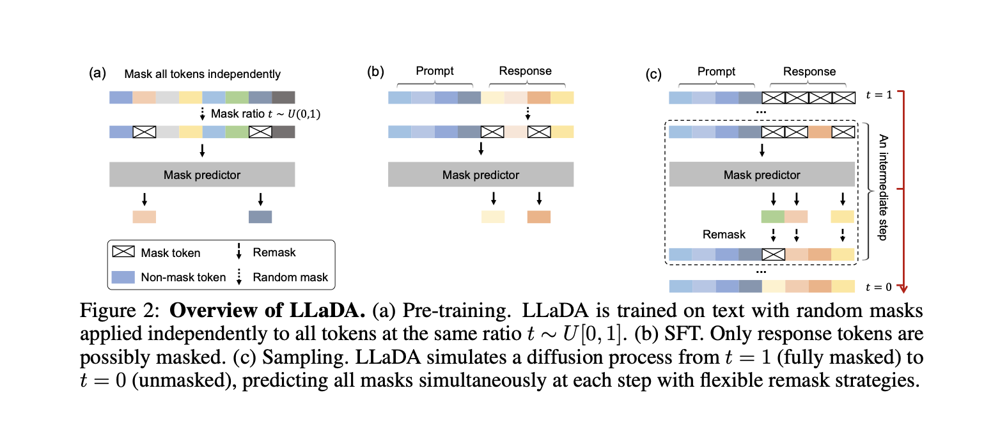

# LLaDA-M series: Large Language Diffusion on Apple Silicon

A clean-room implementation of **Large Language Diffusion Models (LLaDA)** based on the 2025 paper (arXiv:2502.09992). This project demonstrates a shift from standard Autoregressive (GPT-style) text generation to **Masked Diffusion**, built from scratch using PyTorch and optimized for Apple Silicon (M*series) hardware.

## The Concept: Text as Diffusion

Unlike GPT-4 or Llama, which generate text left-to-right (Autoregressive), this model generates the entire sentence simultaneously. It treats text generation as a **denoising** process:
1.  **Start:** A sequence of pure noise (100% masked tokens).
2.  **Process:** Iteratively predict and unmask tokens based on confidence scores.
3.  **End:** A fully formed sentence.

### Simplified Logic
While BERT masks tokens once to predict them (1-step), LLaDA performs this iteratively (multi-step), effectively clearing the "fog" from the text.

```python
x = full_mask()                 # Start with [MASK, MASK, MASK...]
for step in steps:
    prediction = model(x)       # Guess missing tokens
    x = update_mask(prediction) # Lock in high-confidence tokens
return x                        # Final sentence
```

---

## Experiment 1: Proof of Concept (Overfitting Hamlet)

To validate the diffusion mathematics and the custom sampler, I trained the model to overfit on a specific passage (*Hamlet*). This confirmed that the **Confidence-Based Re-masking** schedule was functioning correctly.

**The Run:**
The model starts with uniform noise. By Step 8, the structure emerges. By Step 11, the text is perfect.

```text
Step  | Text
------------------------------------------------------------
0     | ....................................................
2     | .. ... .. ... .. ... .... .. ... ................. .
4     | .o .e. .r ..t t...e. t... .s t.e ....t.o.....e..e...
8     | To be, or not to be, t.at is the ..estion...hether .
11    | To be, or not to be, that is the question:
------------------------------------------------------------
```

**Technical Insight:**
Initially, the model suffered from "Uniform Noise Collapse" (= model outputs a flat distribution over vocab → learns nothing → generates noise) at t=0, outputting identical tokens for every position. I resolved this by implementing **Learnable Positional Embeddings**, giving the model spatial awareness even when the input was 100% masked.

---

## Experiment 2: Generalization (TinyShakespeare)

I scaled the architecture to train on the full `TinyShakespeare` dataset to test character-level generalization capabilities on consumer hardware.

**Configuration:**
*   **Context:** 64 tokens
*   **Model:** Bidirectional Transformer Encoder (128 d_model, 4 layers)
*   **Hardware:** MacBook Air M4 (MPS Backend)

**Training Logs:**
```text
Epoch 1 Average Loss: 3.3432 (Random characters)
Epoch 3 Average Loss: 2.8639
Epoch 5 Average Loss: 2.5793 (English morphology emerging)
...
Extra Epoch 10 Loss: 2.5386 (Convergence Wall)
```

**Result:**
At a loss of ~2.54, the model reached the "Baby Talk" phase. It successfully learned English vocabulary and morphology but lacked syntactic coherence due to limited model capacity and training time.

*Output:*
> "he the the the catne... the home the be you tou home come the he t"

---

## Experiment 3: Supervised Fine-Tuning (SFT) & Transfer Learning



Using the pre-trained weights from Experiment 2, I implemented **Instruction Tuning** (Figure 2b from the LLaDA paper).
**Method:**
Unlike standard diffusion, SFT requires preserving the Prompt while diffusing the Response. I implemented a custom masking strategy that sets the mask probability of prompt tokens to 0.

**The "Thinking" Process (Chatbot Demo):**
The model simultaneously determines the subject and object, filling in the connecting verbs last.

```text
User: Where is the king?
--------------------------------------------------
Step  | Thinking Process
--------------------------------------------------
0     | ............................
5     | The ........................
7     | The k.......................
10    | The kin.....................
11    | The king is in the cast.....
12    | The king is in the castle ..
--------------------------------------------------
Final | The king is in the castle
```

---

## Technical Implementation Details

### 1. Architecture
I used a **Bidirectional Transformer Encoder**. Unlike GPT's Decoder (which uses a causal mask to hide future tokens), this architecture allows the model to attend to both left and right contexts during the denoising process.

### 2. Optimization for Apple Silicon
*   **Backend:** Utilized `torch.backends.mps` to offload matrix multiplications to the M1 Neural Engine.
*   **Tokenizer:** Implemented a lightweight Character-Level tokenizer to maximize training speed and eliminate OOV (Out Of Vocabulary) errors on small datasets.

### 3. Sampling Strategy
Implemented a **Confidence-Based Schedule** rather than a random linear schedule.
*   *Logic:* `num_to_reveal = total_length * (step / total_steps)`
*   The model calculates confidence scores for all masked tokens and "locks in" the top-k most confident predictions at each step.

## Project Structure

* `train.py`: Main pre-training loop using masked diffusion, with resume training capability.
* `main.py`: Inference script that loads the model and generates text.
* `model.py`: Custom LLaDA architecture (Bidirectional Encoder).
* `dataset.py`: Dataset class for TinyShakespeare and tokenizer utilities.
* `utils.py`: Utility functions, including model loading and visualization.
* `sft_demo.py`: Supervised fine-tuning script for Q&A pairs with chatbot demo.

## Usage

1. Install dependencies:
   `pip install torch requests tqdm`

2. Train the model:
   `python3 train.py` (runs initial training, saves model; run again to resume)

3. Run inference:
   `python3 main.py` (loads model if available and generates text)

4. Run SFT and Visualization:
   `python3 sft_demo.py` (fine-tunes on Q&A and demonstrates chatbot)

## Data Source

The `TinyShakespeare` dataset used in this project is sourced from Andrej Karpathy's `char-rnn` repository:  
<https://raw.githubusercontent.com/karpathy/char-rnn/master/data/tinyshakespeare/input.txt>

## Citation

This implementation is based on the paper:  
Li, X., et al. "Large Language Diffusion Models." arXiv:2502.09992 (2025).  
<https://arxiv.org/pdf/2502.09992>
